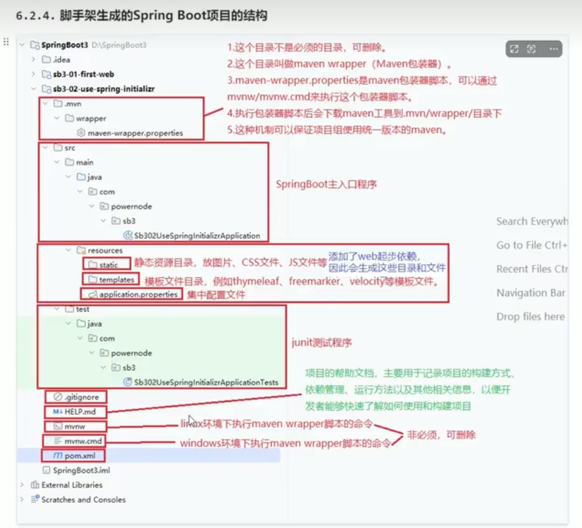
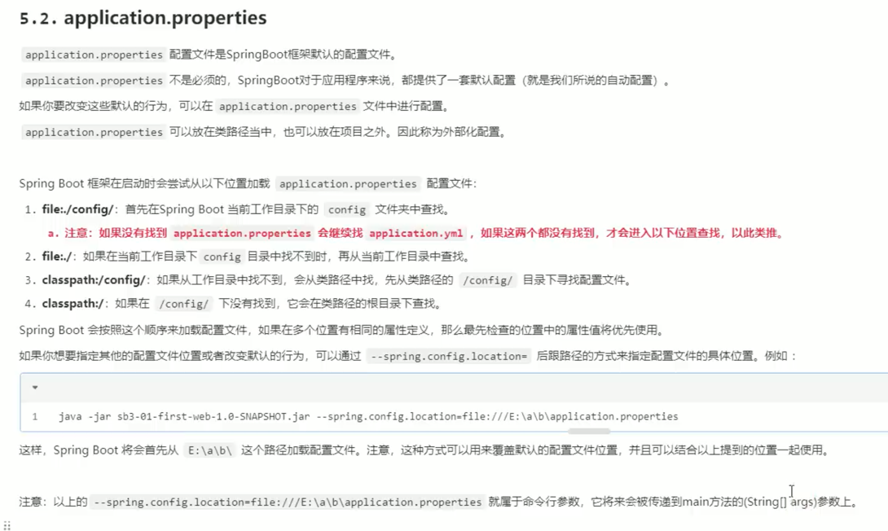

# 动力节点SpringBoot教程

## 1. 认识SpringBoot-官方的解释

## 2. 认识SpringBoot-特性

## 3. 第一个SpringBoot程序

## 4. 纳入IoC容器的Bean的位置要求

## 5. 便捷的部署方式

## 6. SpringBoot打的jar包和普通jar的区别

## 7. 什么是脚手架

## 8. 使用SpringBoot官方提供的脚手架

## 9. 脚手架生成的SpringBoot项目的结构

## 10. 阿里提供的SpringBoot脚手架

## 11. 使用IDEA工具的脚手架插件

## 12. 为何以继承方式引入SpringBoot

## 13. starter启动器

## 14. SpringBoot主入口类是配置类

## 15. SpringBoot的自动配置和组件扫描

## 16. SpringBoot项目做junit单元测试

## 17. 对外部化配置的理解

* SpringBoot支持多种外部化配置方式，包括但不限于:
    - properties文件
    - YAML文件
    - 系统环境变量
    - 命令行参数

## 18. 配置文件加载优先级

## 19. 将配置绑定到对象的属性上

## 20. YAML概述

## 21. YAML的基础语法规则

## 22. YAML语法的小注意事项

## 23. properties配置合并

